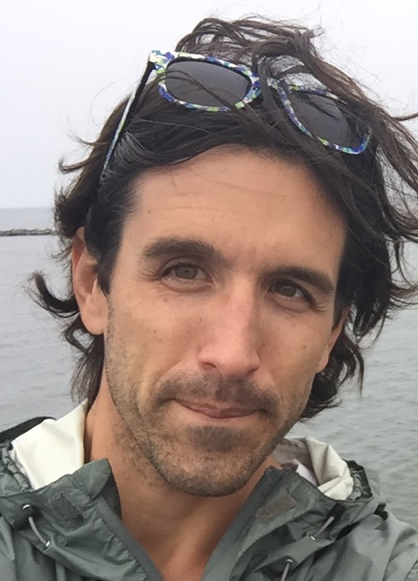

---
---

<link rel="stylesheet" href="styles.css" type="text/css">

I work as a database specialist for the [Michigan Alzheimer's Disease Center](http://alzheimers.med.umich.edu/) in Michigan Medicine's Department of Neurology. I love my work and my job!

I always look for opportunities to break new ground on technically challenging projects, or to collaborate with others on larger, long-term projects that contribute value to my organization. I research and implement solutions to problems that emerge as workflows are improved, and I enjoy investigating new ways to streamline and ensure high quality procedures for development and evaluation of data products.

I'm an avid useR, and I'm always on the lookout for technologies that can improve my work. 

<!-- My full CV is available [here](files/Zabor_CV_2017_Q4.pdf). -->